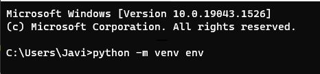
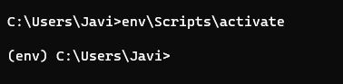
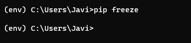
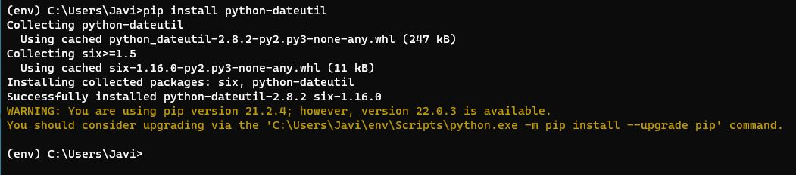
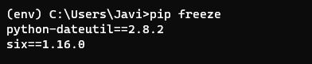

# Ejercicio - Crear un paquete

## Crear un entorno virtual

Ejecutar en la terminal:

```python
python -m venv env
```



Comando para activar el entorno virtual:

```
env/Scripts/activate
```



## Instalar una biblioteca

Ejecuta el comando `pip freeze` para ver las bibliotecas instaladas en tu entorno

```
pip freeze
```



Ejecuta el comando `pip install` para instalar una biblioteca:

```
pip install python-dateutil
```



Vuelve a ejecutar `pip freeze` para ver cómo ha cambiado tu lista de bibliotecas



